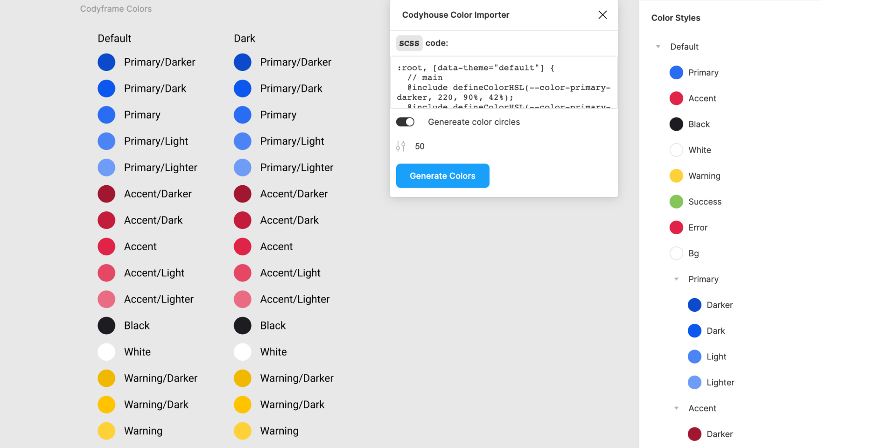

#  Codyhouse Figma Color Importer 🎨 

__Import your colors from [Codyhouse][ch] to [Figma][figma] like never before!__

[][url]

## Features:

This plugin can:
- Import colors from [Codyhouse][ch]: [UI Framework -> Globals -> Colors][colors]
- Create "color sample" circles from imported color
- Split color to themes

## How to use?

1. Open [Codyhouse][ch] and go to color editor ([UI Framework -> Globals -> Colors][colors]).
1. Create your color system and test this.
1. Click to `Copy SCSS`
1. Open [Figma][figma] and run this plugin.
1. Paste your `SCSS` code in textarea.
1. Click to `Generate Color`.
1. _And "Voila!)"_ You have imported colors into your color schemes!

## Contacts:

- Email: me@jagk.ru
- Website: [jagk.ru](https://jagk.ru)
- Repository: [GitHub](https://github.com/jag-k/Codyhouse-Figma-Color-Importer)
- My GitHub: [@jag-k](https://github.com/jag-k)

[figma]: https://figma.com/
[ch]: https://codyhouse.co/
[colors]: https://codyhouse.co/ds/globals/colors
[url]: https://figma.com/